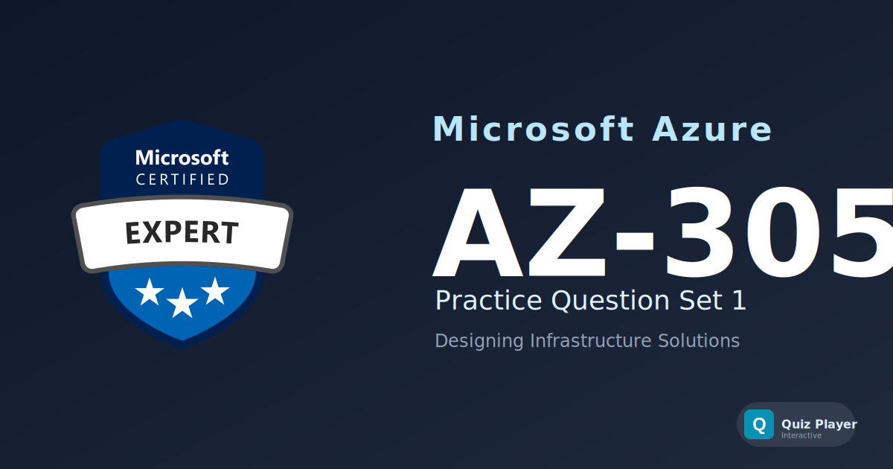

# AZ-305 Practice Section 1

Practice questions for the **Microsoft Azure Solutions Architect Expert (AZ-305)** certification exam. This set tests your ability to design identity and governance solutions, data storage architectures, infrastructure and networking, and business continuity strategies on Azure.

## Content Overview

- **36 Questions** — Single choice, multiple choice, ordering, hotspot, and matching
- **Topics**:
  - Design Identity, Governance, and Monitoring (15 questions)
  - Design Infrastructure Solutions (11 questions)
  - Design Data Storage Solutions (8 questions)
  - Design Business Continuity Solutions (2 questions)

## What This Does Not Cover

This question set focuses on **high-level architectural design decisions**. It does not cover hands-on implementation, CLI/PowerShell commands, ARM template syntax, or detailed cost optimization calculations. It is not a substitute for official Microsoft Learn training paths.

## Disclaimer

> [!IMPORTANT]
> These questions are **AI-generated** for study and practice purposes. They are **not** exam dumps and do not contain actual questions from the Microsoft certification exam. Use them to test your understanding of Azure concepts, not as a substitute for official study materials.

## Usage

This repository is designed to be used with the [Quiz Player](https://quizplay.io). Click the badge above to launch the quiz directly.

## License

This content is licensed under the [GNU Affero General Public License v3.0](LICENSE).
